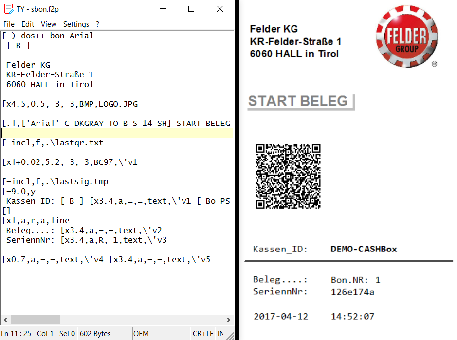

# Reg_KP
Registrierkassen Prüftool
nach österreichischen [Registrierkassensicherheitsverordnung (RKSV)](https://github.com/a-sit-plus/at-registrierkassen-mustercode/releases/download/1.2-DOK/2016-09-05-Detailfragen-RKSV-V1.2.pdf) 


# Muster-Code

In diesem Projekt stelle ich mein C Source.Code (Visual Studio 2013) zur Verfügung 

Verwendete Tools

* APDU winscard.lib
* MS. Cryptography API: Next Generation (CNG) bcrypt.lib

# EXE 
und auch das fertige EXE Programm ist dabei, sofort ersatzbereit zu erstellen und signieren von Kassa-Belegen nach RKSV

WICHTIG: Beachten Sie, dass wir für Freeware keine Garantie und keinen Support leisten! Jegliche Haftung wird ausgeschlossen, die Verwendung erfolgt auf eigenes Risiko! Mit dem Download akzeptieren Sie die Lizenzbestimmung

# Erstellen von Start Beleg

siehe ts.bat in Repository

wir brauchen zwei steuerungs Dateien 
* .\kpar.txt  mit kassen-ID AES-Key und. Cert_Ser_Nr
* .\bel2dep.txt  mit Beleg-Nummer, Beleg-Art, und die einzelne Beträge in Cent

die durch aufruf von REGKP.EXE signiert werden, dabei werden die Dateien (klastbel.txt,deplog.txt) erstellt

mit REGKP.EXE -xj  werden die json Dateien exportiert (dep-export.json, crypto.json) 

mit "REGKP -xc" kann das Zertifikat auf .\cert.hex ausgeben um zB. bei https://certlogik.com/decoder/  zu testen.

#  REGKP.exe NEU
 
cmdline Version von RegKP,  eingabe via cmdline ausgabe nach stdout 
(so wird auch mit PSExec auf remote PC startbar (zB. bei 1 Reader, mehrere Kassenplätze))

signiert Belege zB: mit "RegKP \~INF11-030-17\~STA\~120" 

(Feld Trennzeichen \~, Belegnummer, Beleg-Art, Beträge in Cent)

Beleg-Art: erlaubt sind "START;STA;STO,NUL;TRA" ( \~\~ = STA )  

einfache Test von Reader und Signatur mit: "RegKP -tsb" 
erstellt und signiert einen Startbeleg, exportiert die json Dateien für das Prüftool
Kassendaten in .\kpar.txt

Ausgabe .\lastsig.txt damit auch QR Code OK zB:

* _R1-AT1_RegK-IBK-D9C_INF11-030-17_2017-03-29T00:29:30_1,20_0,00_0,00_0,00_0,00_/yRlUXg...
* G-bBhkqt0p7vkd7jmW-RmMLIH2Deg_qPPlzrCOuDdgRlsDfR-0kmsZfrzQuDmewa_YkmRJI8RQTnPL6h6EI9oA
* G+bBhkqt0p7vkd7jmW+RmMLIH2Deg/qPPlzrCOuDdgRlsDfR+0kmsZfrzQuDmewa/YkmRJI8RQTnPL6h6EI9oA==
* 48
* INF11-030-17

in Zeile 3 Signatur Base64 codiert, also für QR Code (Zeile1 + "_" + Zeile3) zu drucken

einige neue Parameter dazu:
-ri Reader Info 
-ci Certificate Info ( in cert.as1 )

# am 04/04/2017

RegKP mit ONLine-Konten Unterstützung, (verwendet curl.exe)
Achtung! curl.exe muss im gleichen Ordner wie RegKP.exe vorhanden sein!

einfach in KPAR.TXT in Zeile-4 und 5 die Zugangsdaten eintragen,
fangt Zeile-4 mit 'u' an, wird auf online signieren umgeschaltet

```Beispiel .\KPAR.TXT
DEMO-CASHBox
QRtiiya3hYh/Uz44Bv3x8ETl1nrH6nCdErn69g5/lU=
26e174a
u36794969
v1wxyz
```

# am 07/04/2017

RegKP.7z als gesamtprojekt (inkl. curl.exe und blat.dll)
erweitert mit Mail support, einige Beispiele
```
RegKP -? 
RegKP -si 
RegKP -ou u123456789 -si 
```
oder sende Statusbericht von RK-online Konto an test@mail.com 
```
RegKP -ou u123456789 -mto test@mail.com
```
oder sende Statusbericht von ATrust-Karte an Zertifikate inhaber 
```
RegKP -mc
```

# am 12/04/2017

RegKP_all.7z erweitert mit drucken, (durch f2p.exe),
mit dem Parameter -sf setzen wir wie f2p.exe gestartet wird 

```
RegKP -sf sbon.f2p -tsb

RegKP -sf "sbon.f2p -or -x" -tsb 
```
oder signieren und drucken: 
```
RegKP -sf "bon.f2p -od" ~BON##~~240
```

f2p.exe unsere Flex to PDF Konverter in f2p Ordner (mit Demo Banner, kann aber pro UID freigeschaltet werden)
recht komplex aber sehr flexibel, die zwei Beispiele sbon und bon:



geplant: * Quartals Daten-Backup via Mail (an safe@atsafe.at)
         * Meldungen via WebService
         u.s.w.
